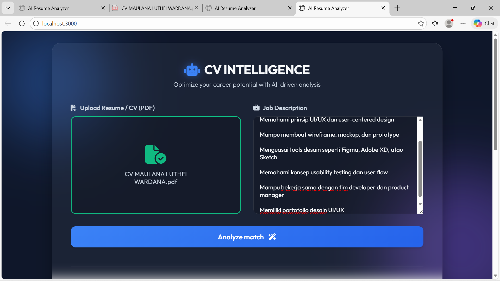
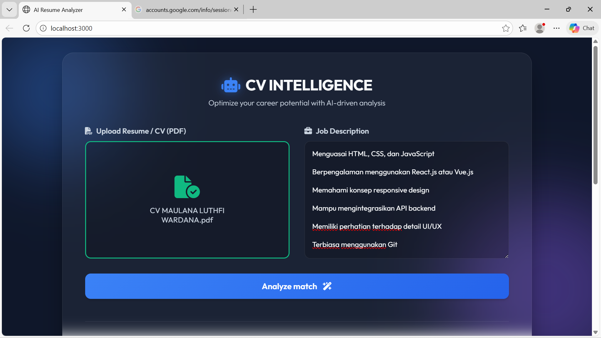
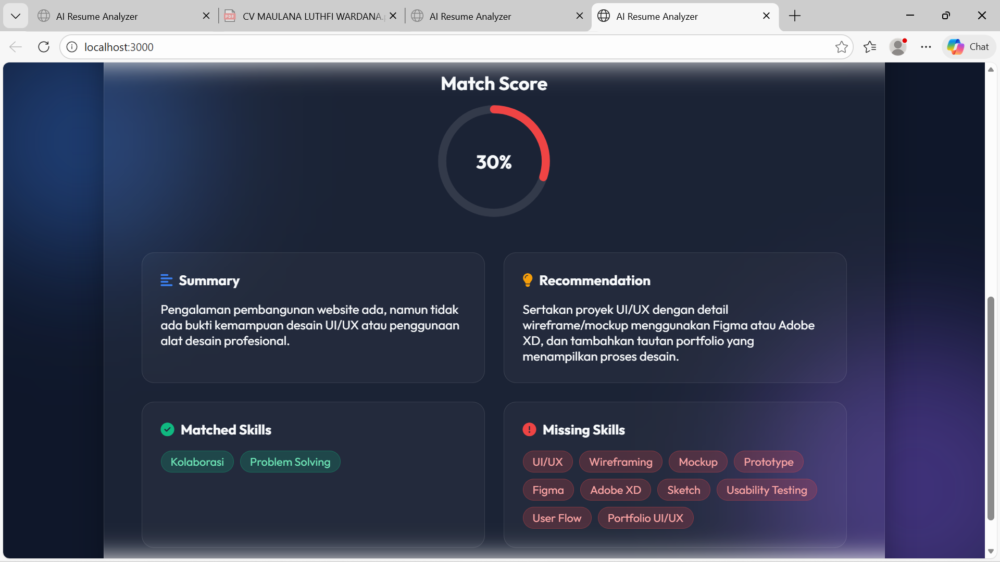
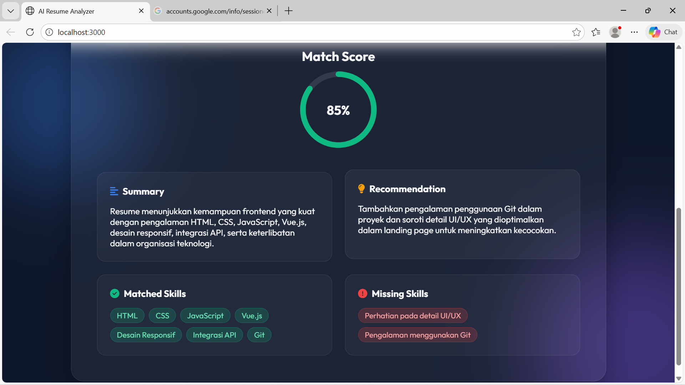

# 📄 AI CV Tracker

AI CV Tracker adalah aplikasi berbasis web yang membantu pengguna menganalisis tingkat kecocokan antara CV (Resume) dengan Job Description menggunakan Artificial Intelligence (Large Language Model).

Aplikasi ini dikembangkan sebagai bagian dari **Tugas UAS** dengan objektif mata kuliah **“Kecerdasan Buatan”**.

---

## 🚀 Fitur Utama

- 📄 **Input CV (Resume)**  
  Pengguna dapat memasukkan teks CV secara langsung ke dalam aplikasi.

- 🧾 **Input Job Description**  
  Pengguna dapat memasukkan deskripsi pekerjaan yang ingin dilamar.

- 🤖 **Analisis Otomatis oleh AI**  
  Sistem menggunakan AI untuk membandingkan CV dan Job Description.

- 📊 **Match Score (%)**  
  Menampilkan tingkat kecocokan CV terhadap posisi pekerjaan.

- ✅ **Matched Skills**  
  Menampilkan skill yang sudah sesuai dengan kebutuhan pekerjaan.

- ❌ **Missing Skills**  
  Menampilkan skill yang belum ada di CV namun dibutuhkan oleh Job Description.

- 📝 **Summary & Recommendation**  
  Ringkasan kecocokan dan rekomendasi perbaikan CV dari AI.

---

## 🎯 Manfaat Aplikasi

- Membantu pencari kerja mengevaluasi CV sebelum melamar pekerjaan  
- Memberikan insight skill apa saja yang perlu ditingkatkan  
- Menghemat waktu HR atau recruiter dalam proses screening awal  
- Menjadi contoh implementasi nyata integrasi AI dalam aplikasi web  

---

## 🧠 Teknologi yang Digunakan

- **Frontend:** HTML, CSS, JavaScript  
- **Backend:** Node.js, Express.js  
- **AI Engine:** OpenRouter API  
- **Model AI:** LLaMA 3 8B Instruct  
- **AI Integration:** REST API  
- **Server:** Localhost (tanpa database / stateless application)

---

## 🔄 Workflow Aplikasi

1. User membuka aplikasi melalui browser  
2. User memasukkan teks CV  
3. User memasukkan Job Description  
4. Frontend mengirim data ke backend (Express API)  
5. Backend mengirim prompt ke AI melalui OpenRouter API  
6. AI menganalisis kecocokan CV dan Job Description  
7. AI mengembalikan hasil analisis dalam format JSON  
8. Backend memproses dan mengirim hasil ke frontend  
9. Frontend menampilkan hasil analisis ke user  

---

## 📷 Screenshot / Demo Aplikasi

### Tampilan Form Input



### Hasil Analisis AI



---

## 📦 Cara Menjalankan Aplikasi (Local)

1. Clone Repository
    ```bash
    git clone https://github.com/username/CVTracker.git
    
2. Masuk ke folder project
  ```bash
  cd CVTracker
  ```

3. Install dependencies
  ```bash
  npm install
  ```
4, Buat file .env

  Buat file .env di root project, lalu isi dengan:
   ```bash
  OPENROUTER_API_KEY=your_api_key_here
   ```

5. Jalankan server
    ```bash
    node server.js

6. Buka aplikasi di browser
 ```bash
http://localhost:3000
```
## 👤 Identitas 

- **Nama:** Maulana Luthfi Wardana  
- **NIM:** 23121049  
- **Project:** AI CV TRACKER 
- **Keterangan:** Tugas Ujian Akhir Semester (UAS) – Kecerdasan Buatan


